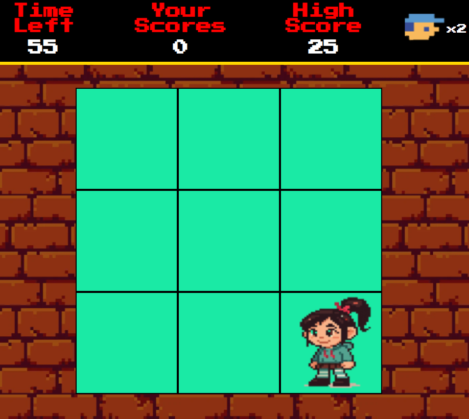

# 🕹️ Jogo Detona Ralph – Desafio DIO

Projeto desenvolvido durante o bootcamp **"Coding the Future: Front-End do Zero"** da [DIO](https://web.dio.me/).  
O objetivo era criar um jogo interativo com JavaScript, baseado no personagem Ralph do filme Detona Ralph.

💻 **Veja o projeto online:**  
🔗 [https://matheus97px.github.io/wreck-ralph/](https://matheus97px.github.io/wreck-ralph/)

---

## 🎮 Funcionalidades

- Ralph aparece aleatoriamente na tela
- Penelope aparece como distração (cliques errados tiram vidas)
- Pontuação em tempo real
- Vidas limitadas
- Som de acerto, erro e derrota
- Música de fundo
- Níveis de dificuldade automática
- Jogo responsivo para celular
- Recorde salvo com `localStorage`
- Tela de fim de jogo com placar final

---

## 🛠️ Tecnologias usadas

---

## 📸 Screenshot

 

---

## 📚 Aprendizados

- Manipulação do DOM com JS
- Eventos `mousedown`, `setInterval`, `Math.random`
- Controle de tempo, pontuação e lógica condicional
- Animações com CSS e áudio com JS
- Responsividade com `vw`, `flex` e media queries

---

## 🚀 Próximos passos

- Arrumar a responsividade de tela em todos os dispositivos moveis
- Criar fases e níveis
- Adicionar contador de erros
- Tela inicial e reinício elegante
